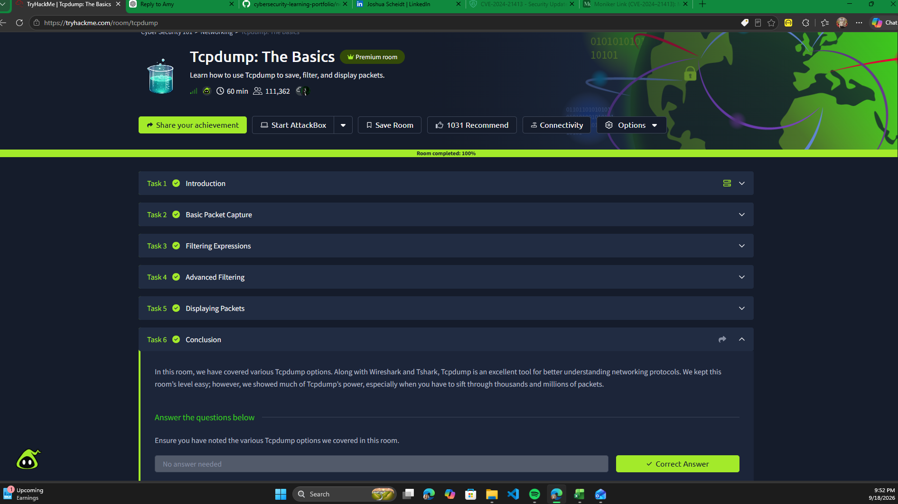

# tcpdump: The Basics — TryHackMe

## Overview

Completed the TryHackMe *Tcpdump: The Basics* room as part of my hands-on cybersecurity training. This room introduces command-line packet capture and the use of tcpdump to save, filter, and display network traffic.

## Topics Covered

- Capturing network packets from the command line.
- Displaying captured traffic in a terminal.
- Filtering traffic to focus on relevant packets.
- Saving packet captures for later analysis.

## Security Relevance

Tcpdump helps security analysts inspect network communications, investigate unusual traffic, and collect packet evidence for further analysis. Command-line capture is particularly useful when working on systems without a graphical interface.

## Hands-On Command Analysis

## Hands-On Command Analysis

### Five-Packet TCP Capture

**Tool:** tcpdump

**Capture:** Five packet records collected from a lab network interface.

**Observed traffic:** A TCP conversation between `10.64.157.3:22` and `10.64.109.134:32938`.

### Observed Results

| Packet | Direction | TCP flags | Payload length | Observation |
|---|---|---|---|---|
| 1 | Port 22 → Port 32938 | PSH, ACK | 188 bytes | Data sent from port 22 |
| 2 | Port 32938 → Port 22 | ACK | 0 bytes | Acknowledged the first data segment |
| 3 | Port 22 → Port 32938 | PSH, ACK | 364 bytes | Additional data sent |
| 4 | Port 22 → Port 32938 | PSH, ACK | 196 bytes | Additional data sent |
| 5 | Port 32938 → Port 22 | ACK | 0 bytes | Acknowledged data through sequence number 552 |

### Analysis

- Identified source and destination IP addresses and TCP ports from tcpdump output.
- Recognized port 22 as commonly associated with SSH, while treating the application protocol as unconfirmed from packet summaries alone.
- Distinguished data-carrying TCP segments from acknowledgment-only segments using the flags and payload lengths.
- Observed that the final captured acknowledgment did not cover all data shown in the five-packet excerpt. The capture was too short to determine what happened next.
- Learned that packet metadata can help explain communication patterns without revealing encrypted application content.

**Scope:** This entry documents traffic observed during an authorized training exercise. No attack, compromise, or incident was established by this capture.

### Command Executed

_To be added after the lab exercise._

### Observed Results

_To be added after reviewing the actual output._

### What I Learned

_To be added after completing the exercise._

## Completion Evidence

- [View my TryHackMe tcpdump achievement](https://tryhackme.com/room/tcpdump?utm_campaign=social_share&utm_medium=social&utm_content=share-completed-room&utm_source=copy&sharerId=6a2ce4065b8629fb7af768d6)
- [My public TryHackMe profile](https://tryhackme.com/p/joshua.scheidt)
- 

*This entry documents guided cybersecurity training. It does not represent professional incident-response work or analysis of a third-party network.*
