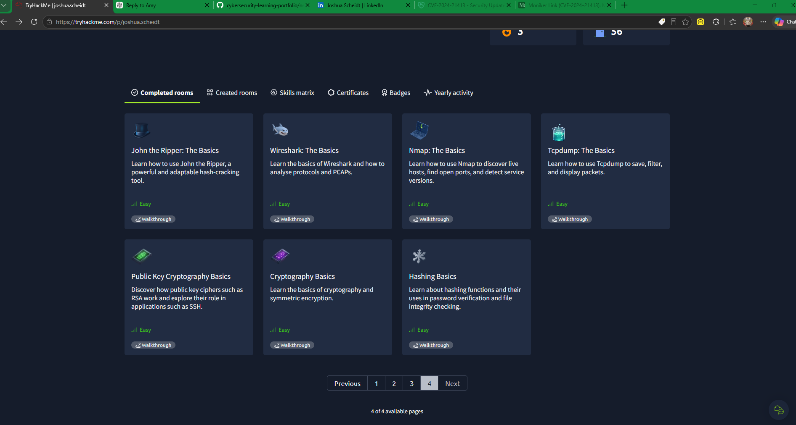

# Wireshark: The Basics

## Training Platform
TryHackMe

## Completion Status
**Completed — 100%**

Room: https://tryhackme.com/room/wiresharkthebasics

Public profile: https://tryhackme.com/p/joshua.scheidt

## Overview
Completed the TryHackMe "Wireshark: The Basics" room, focused on understanding Wireshark and analyzing network protocols and packet capture (PCAP) files.

## Completed Tasks
1. Introduction
2. Tool Overview
3. Packet Dissection
4. Packet Navigation
5. Packet Filtering
6. Conclusion

All six tasks are marked complete in my TryHackMe account.

## Skills and Concepts Covered
- Navigating the Wireshark interface
- Understanding packet structure and protocol information
- Navigating packets within a capture
- Using packet filtering concepts
- Examining network traffic through PCAP analysis

## Cybersecurity Relevance
Wireshark is useful to security analysts for examining network communications, identifying protocols, investigating suspicious traffic, and supporting incident response.

## Completion Evidence

- [View my TryHackMe Wireshark completion achievement](https://tryhackme.com/room/wiresharkthebasics?utm_campaign=social_share&utm_medium=social&utm_content=share-completed-room&utm_source=copy&sharerId=6a2ce4065b8629fb7af768d6)
- Completion status: **100% — all six tasks completed**
- [My public TryHackMe profile](https://tryhackme.com/p/joshua.scheidt)
- 

## Next Steps
Expand this write-up with sanitized examples of filters, packet observations, and conclusions from an authorized lab exercise.

Note: This write-up documents training completion. It does not represent professional incident-response experience or claim findings that have not been documented.
