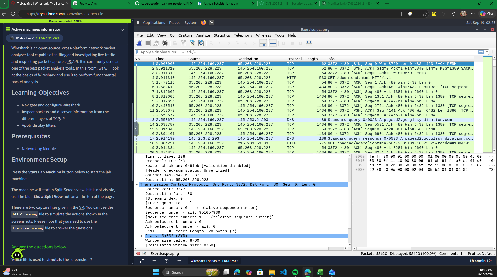

# Wireshark: The Basics

## Training Platform
TryHackMe

## Completion Status
**Completed — 100%**

Room: https://tryhackme.com/room/wiresharkthebasics

Public profile: https://tryhackme.com/p/joshua.scheidt

## Overview
Completed the TryHackMe "Wireshark: The Basics" room, focused on understanding Wireshark and analyzing network protocols and packet capture (PCAP) files.

## Completed Tasks
1. Introduction
2. Tool Overview
3. Packet Dissection
4. Packet Navigation
5. Packet Filtering
6. Conclusion

All six tasks are marked complete in my TryHackMe account.

## Skills and Concepts Covered
- Navigating the Wireshark interface
- Understanding packet structure and protocol information
- Navigating packets within a capture
- Using packet filtering concepts
- Examining network traffic through PCAP analysis

## Cybersecurity Relevance
Wireshark is useful to security analysts for examining network communications, identifying protocols, investigating suspicious traffic, and supporting incident response.

## Hands-On Packet Analysis

### TCP Connection Establishment and HTTP Request

**Capture file:** `Exercise.pcapng` — TryHackMe training exercise.

**Packet 1 observations:**

| Field | Value |
|---|---|
| Source IP | `145.254.160.237` |
| Destination IP | `65.208.228.223` |
| Source port | `3372` |
| Destination port | `80` |
| Protocol | TCP |
| Packet length | 62 bytes |
| TCP flags | SYN |
| TCP payload | 0 bytes |

**Analysis:** Packet 1 is a TCP SYN sent from source port 3372 to destination port 80, initiating a connection. Packets 2 and 3 show SYN-ACK and ACK, consistent with completion of the TCP three-way handshake. Packet 4 contains an HTTP `GET /download.html` request.

**Security relevance:** Inspecting packet sequences helps analysts distinguish connection establishment from application-layer requests and establish the order of observed network activity.

**Scope:** These observations come from a provided TryHackMe PCAP. The traffic shown does not, by itself, establish malicious activity.

## Completion Evidence

- [View my TryHackMe Wireshark completion achievement](https://tryhackme.com/room/wiresharkthebasics?utm_campaign=social_share&utm_medium=social&utm_content=share-completed-room&utm_source=copy&sharerId=6a2ce4065b8629fb7af768d6)
- Completion status: **100% — all six tasks completed**
- [My public TryHackMe profile](https://tryhackme.com/p/joshua.scheidt)
- 

## Next Steps
Expand this write-up with sanitized examples of filters, packet observations, and conclusions from an authorized lab exercise.

Note: This write-up documents training completion. It does not represent professional incident-response experience or claim findings that have not been documented.
