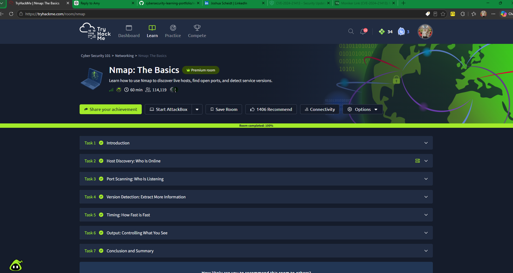

# Nmap: The Basics — TryHackMe

## Overview

Completed the TryHackMe *Nmap: The Basics* room as part of my hands-on cybersecurity training. The room introduces network reconnaissance using Nmap, including discovering live hosts, identifying open ports, and detecting service versions.

## Topics Covered

- Host discovery and identifying reachable systems.
- Port scanning and interpreting open-port results.
- Service and version detection.
- Understanding how network visibility supports security assessments.

## Security Relevance

Nmap helps security teams understand which hosts and services are exposed on a network. This information can support asset discovery, authorized vulnerability assessments, and investigation of unexpected network services.

## Completion Evidence

## Completion Evidence

- [View my TryHackMe Nmap completion achievement](https://tryhackme.com/room/nmap?utm_campaign=social_share&utm_medium=social&utm_content=share-completed-room&utm_source=copy&sharerId=6a2ce4065b8629fb7af768d6)
- [My public TryHackMe profile](https://tryhackme.com/p/joshua.scheidt)
- 

*This entry documents a guided training room, not a professional penetration test or an assessment of a third-party network.*
