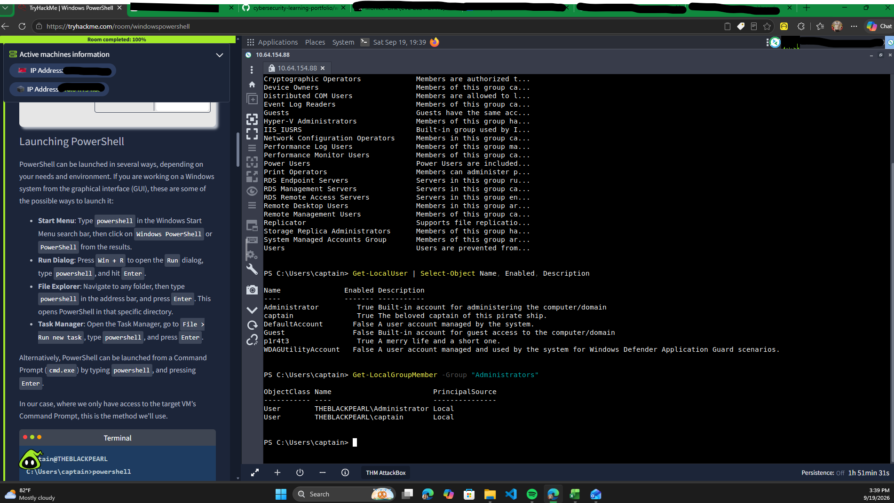
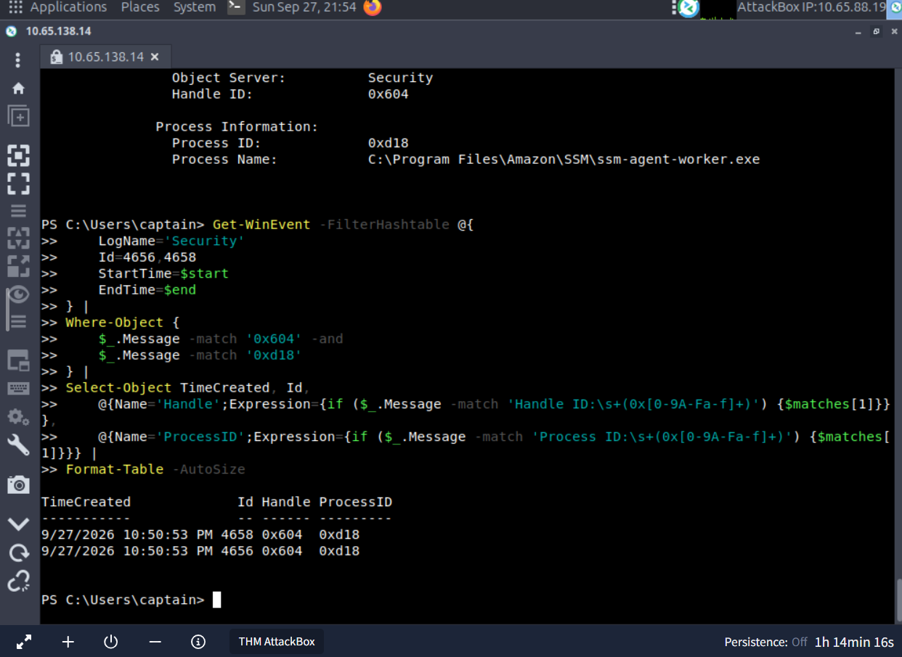

# Windows Security Fundamentals — Hands-On Lab

## Objective

Practice Windows security administration and investigation using PowerShell, with a focus on local accounts, group membership, and the principle of least privilege.

## Lab Environment

- Operating system: To be confirmed
- Environment: Authorized training system
- Tool: PowerShell

## Commands Executed

```powershell
Get-LocalGroup
Get-LocalUser | Select-Object Name, Enabled, Description
Get-LocalGroupMember -Group "Administrators"
```

## Observed Results

- Identified six local user accounts: three enabled and three disabled.
- Observed that the built-in Administrator account was enabled and the built-in Guest account was disabled.
- Identified two local user accounts in the Administrators group.
- Enumerated local security groups, including Event Log Readers and Remote Desktop Users. Group membership was not inspected for those groups.

## Security Analysis

Local account enumeration provides visibility into account status and potential administrative access. Reviewing the Administrators group helps identify accounts with elevated privileges and supports least-privilege assessments.

An enabled Administrator account or multiple administrator memberships is not automatically a security finding. Determining whether these settings are appropriate requires additional context, such as organizational policy and the intended purpose of each account.

**Scope:** Read-only inspection of an authorized TryHackMe Windows training machine. No account permissions or settings were changed.

## Evidence



## Scope and Limitations

This project documents an authorized learning exercise. Account information and other sensitive details will be excluded from the public repository.
## Windows Security Event Log Investigation

### Objective

Use PowerShell to examine Windows Security Event Log activity and practice correlating related events using timestamps, account information, process IDs, and handle IDs.

### Security Log Enumeration

I retrieved the ten most recent events from the Windows Security log:

```powershell
Get-WinEvent -LogName Security -MaxEvents 10
```

The results included several object-access auditing events:

- Event ID 4656 — A handle to an object was requested
- Event ID 4658 — The handle to an object was closed
- Event ID 4690 — An attempt was made to duplicate a handle to an object

These events were treated as audit records rather than evidence of malicious activity.

### Event 4656 Investigation

I examined a recent Event ID 4656 in greater detail:

```powershell
Get-WinEvent -FilterHashtable @{LogName='Security'; Id=4656} -MaxEvents 1 |
Format-List TimeCreated, Id, Message
```

The event showed PowerShell requesting access to the `Microsoft.PowerShell.Utility.psm1` module.

Observed details included:

- Object Type: File
- Process: `powershell.exe`
- Process ID: `0xd04`
- Handle ID: `0x814`
- Requested access included `READ_CONTROL`, `SYNCHRONIZE`, `ReadData`, `ReadEA`, and `ReadAttributes`
- The requested access was granted

The observed permissions were consistent with read-oriented access to the PowerShell module. This event alone did not indicate malicious activity.

### Event Correlation

I then attempted to locate an Event ID 4658 associated with the same handle. Searching only the ten most recent 4658 events returned no match, demonstrating how a narrow event search can miss relevant records in an active log.

I refined the investigation by searching within a small time window surrounding the original event:

```powershell
$start = [datetime]'9/27/2026 10:20:54 PM'
$end   = [datetime]'9/27/2026 10:20:56 PM'

Get-WinEvent -FilterHashtable @{
    LogName='Security'
    Id=4658
    StartTime=$start
    EndTime=$end
} |
Where-Object {$_.Message -match '0x814'} |
Format-List TimeCreated, Id, Message
```

The refined search returned Event ID 4658 records containing the same handle ID. Matching fields included:

- Account: `THEBLACKPEARL\captain`
- Process: `powershell.exe`
- Process ID: `0xd04`
- Handle ID: `0x814`
- Timestamp: same second as the investigated Event 4656

These fields provided multiple correlation points between the object-access events.

Multiple 4658 records containing the same handle value were present within the same second. Because handle values may be reused and the displayed timestamps only provided second-level precision, I treated these as matching correlation candidates rather than claiming that every returned 4658 record represented the closure of the specific 4656 handle.

### Event 4690 Review

I also examined Event ID 4690:

```powershell
Get-WinEvent -FilterHashtable @{LogName='Security'; Id=4690} -MaxEvents 1 |
Format-List TimeCreated, Id, Message
```

The sampled event occurred at a different time and contained different account, process, and handle information from the previously investigated Event 4656.

I therefore did not correlate the sampled 4690 event with the earlier PowerShell file-access activity.

### Security Analysis

This exercise demonstrated that Windows event investigation requires more than identifying Event IDs. Useful correlation fields can include:

- Timestamp
- User or security principal
- Process ID
- Process name
- Handle ID
- Object type and object name
- Requested access

The investigation also demonstrated the importance of adjusting query scope. A search limited to the most recent records initially failed to locate a related event, while a targeted time-window query returned relevant candidates.

No malicious activity was established during this investigation. The observed events were analyzed as Windows auditing data from an authorized training environment.

### Skills Practiced

- Windows Security Event Log analysis
- PowerShell `Get-WinEvent`
- Event ID filtering
- ### Event Correlation Evidence

The screenshot below shows a PowerShell query correlating Windows Security Events 4656 and 4658 using multiple fields.

Both events were recorded at the same timestamp and contained the same:

- Handle ID: `0x604`
- Process ID: `0xd18`

This provided additional evidence that the records were associated with the same object-access activity.


- Time-based event filtering
- Object-access auditing
- Event correlation
- Process and account analysis
- Evidence-based security investigation

